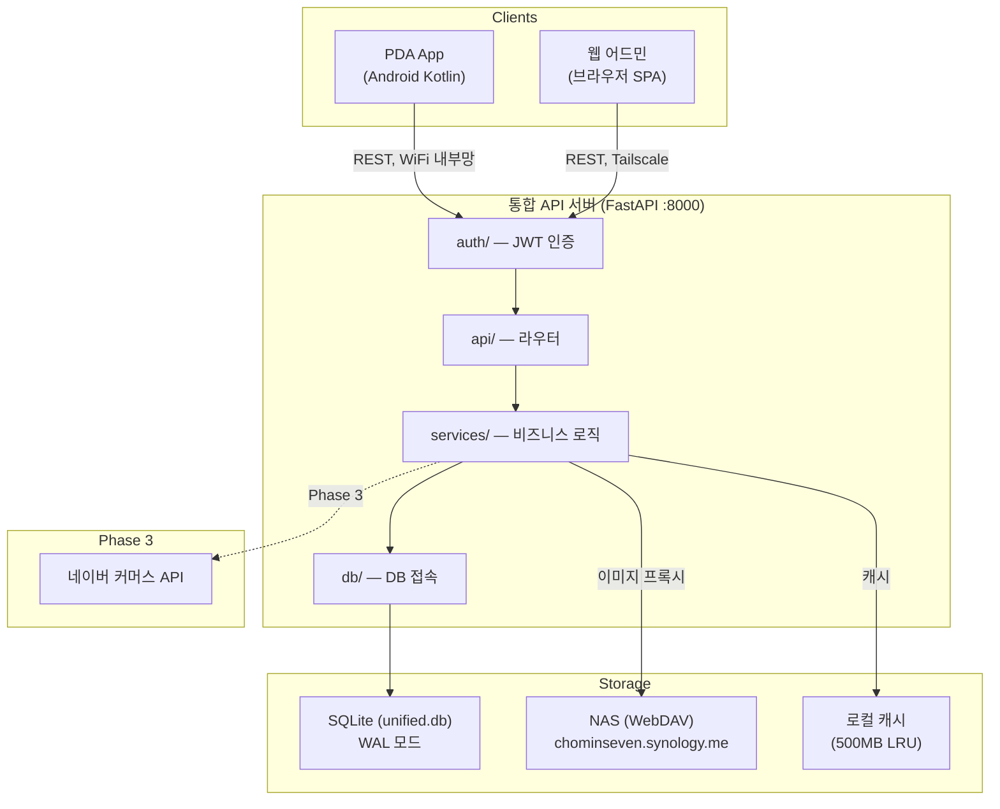

# 통합 어드민 시스템 아키텍처

> **Version:** 1.0 | **Date:** 2026-03-23 | **Status:** 설계 완료

## 시스템 개요

스페이스쉴드 스마트워치 스트랩 통합 관리 시스템.
PDA 바코드 스캐너(scan) + 제품 백과사전(strap-db) + 재고관리 + 창고/공급업체 지도를 단일 FastAPI 서버로 통합.

## 컴포넌트 다이어그램



## 배포 환경

| 항목 | 값 |
|------|-----|
| 서버 | 미니PC (Windows 11) |
| Tailscale IP | 100.125.17.60 |
| 포트 | 8000 (통합, 기존 scan 포트 유지) |
| DB | SQLite WAL 모드 |
| NAS | chominseven.synology.me:58890 (WebDAV) |
| PDA | Zebra TC60 (Android, WiFi) |
| 자동시작 | NSSM Windows 서비스 |

## 디렉토리 구조

```
unified-admin/
├── server/
│   ├── app/
│   │   ├── main.py                 # FastAPI app, CORS, lifespan
│   │   ├── config.py               # Pydantic BaseSettings
│   │   ├── auth/
│   │   │   ├── auth_service.py     # JWT 발급/검증, bcrypt
│   │   │   ├── auth_middleware.py  # Depends() 인증
│   │   │   └── permissions.py      # role 기반 권한
│   │   ├── api/
│   │   │   ├── scan.py             # PDA 바코드 스캔
│   │   │   ├── products.py         # 제품 마스터 CRUD
│   │   │   ├── skus.py             # SKU CRUD
│   │   │   ├── stock.py            # 재고 수정 + 이력
│   │   │   ├── matrix.py           # 런칭 매트릭스
│   │   │   ├── family.py           # 제품 계보
│   │   │   ├── warehouse.py        # 창고 지도
│   │   │   ├── suppliers.py        # 공급업체
│   │   │   ├── search.py           # FTS5 통합 검색
│   │   │   ├── sync.py             # 스토어 동기화 (Phase 3)
│   │   │   ├── images.py           # NAS 프록시
│   │   │   ├── users.py            # 사용자 관리
│   │   │   └── import_data.py      # 엑셀 파싱
│   │   ├── db/
│   │   │   ├── database.py         # aiosqlite, WAL, FK
│   │   │   └── schema.py           # DDL + 마이그레이션
│   │   ├── models/                 # Pydantic v2
│   │   ├── services/               # 비즈니스 로직
│   │   └── utils/
│   ├── data/
│   │   ├── unified.db              # 통합 DB
│   │   ├── cache/                  # 이미지 캐시
│   │   └── xlsx/                   # 엑셀 감시
│   └── requirements.txt
└── web/                            # 웹 어드민 SPA
    └── index.html
```

## API 엔드포인트

### 인증
| Method | Path | 설명 | 권한 |
|--------|------|------|------|
| POST | /api/auth/login | JWT 발급 | public |
| POST | /api/auth/refresh | 토큰 갱신 | authenticated |
| GET | /api/auth/me | 내 정보 | authenticated |

### PDA 스캔 (Phase 1)
| Method | Path | 설명 | 권한 |
|--------|------|------|------|
| POST | /api/scan | 바코드→제품+SKU+재고 | staff+ |

### 제품 마스터 (Phase 1)
| Method | Path | 설명 | 권한 |
|--------|------|------|------|
| GET | /api/products | 목록 (페이지네이션) | staff+ |
| GET | /api/products/{id} | 상세 (SKU 포함) | staff+ |
| POST | /api/products | 생성 | admin |
| PUT | /api/products/{id} | 수정 (version 필수) | admin |
| DELETE | /api/products/{id} | 삭제 | admin |

### SKU (Phase 1)
| Method | Path | 설명 | 권한 |
|--------|------|------|------|
| GET | /api/skus | 목록 | staff+ |
| GET | /api/skus/{id} | 상세 (바코드 포함) | staff+ |
| POST | /api/skus | 생성 | admin |
| PUT | /api/skus/{id} | 수정 | admin |
| POST | /api/skus/{id}/barcodes | 바코드 추가 | admin |

### 재고 (Phase 1)
| Method | Path | 설명 | 권한 |
|--------|------|------|------|
| PUT | /api/stock/{sku_id} | 수정 (트랜잭션+이력) | staff+ |
| GET | /api/stock/{sku_id}/logs | 변경 이력 | staff+ |
| GET | /api/stock/summary | 요약 통계 | admin |

### 런칭 매트릭스 (Phase 1)
| Method | Path | 설명 | 권한 |
|--------|------|------|------|
| GET | /api/matrix | 교차표 | staff+ |
| PUT | /api/matrix/{pid}/{wid} | 셀 업데이트 | admin |

### 제품 계보 (Phase 1)
| Method | Path | 설명 | 권한 |
|--------|------|------|------|
| GET | /api/families | 패밀리 목록 | staff+ |
| GET | /api/families/{id} | 상세 (멤버+트리) | staff+ |
| POST | /api/families | 생성 | admin |
| PUT | /api/families/{id}/members | 멤버 수정 | admin |

### 검색 (Phase 1)
| Method | Path | 설명 | 권한 |
|--------|------|------|------|
| GET | /api/search?q= | FTS5 통합 검색 (≤0.5초) | staff+ |

### 이미지 / 워치모델 / 카테고리 / 사용자 / 데이터임포트 (Phase 1)
| Method | Path | 설명 | 권한 |
|--------|------|------|------|
| GET | /api/images/proxy?path= | NAS 프록시 | staff+ |
| GET | /api/watch-models | 목록 | staff+ |
| GET | /api/categories | 목록 | staff+ |
| GET/POST | /api/users | 사용자 관리 | admin |
| POST | /api/import/xlsx | 엑셀 임포트 | admin |

### 창고/공급업체 (Phase 2)
| Method | Path | 설명 | 권한 |
|--------|------|------|------|
| GET/POST | /api/warehouse/zones | 구역 관리 | admin |
| GET/PUT | /api/warehouse/locations | 위치 관리 | admin |
| GET/POST | /api/suppliers | 공급업체 관리 | admin |

### 스토어 동기화 (Phase 3)
| Method | Path | 설명 | 권한 |
|--------|------|------|------|
| GET/PUT | /api/channels/{sku_id}/prices | 채널 가격 | admin |
| POST | /api/sync/smartstore | 동기화 실행 | admin |

## 핵심 데이터 흐름

### 1. PDA 바코드 스캔
```
PDA → POST /api/scan {barcode}
  → barcode 테이블 조회 → sku_id
  → sku + product_master JOIN
  → NAS 이미지 프록시 (캐시)
  → 응답: {product, sku, stock, images}
```

### 2. 재고 수정 (PDA/웹 공통)
```
Client → PUT /api/stock/{sku_id} {qty, version, memo, device}
  → BEGIN IMMEDIATE
  → SELECT stock_quantity, version (version 검증)
  → INSERT stock_log (before/after/who/device)
  → UPDATE sku SET stock_quantity, version+1
  → COMMIT
  → 성공: 200 {qty, version}
  → 충돌: 409 {current_version, current_qty}
```

### 3. 런칭 매트릭스 조회
```
웹 → GET /api/matrix?category_id=
  → product_watch_model JOIN product_master JOIN watch_model
  → 교차표 데이터 반환
  → {rows: [products], columns: [watch_models], cells: [{status, assigned_to}]}
```

## 기술 결정

### SQLite WAL 모드
```python
await db.execute("PRAGMA journal_mode=WAL")
await db.execute("PRAGMA busy_timeout=5000")
await db.execute("PRAGMA foreign_keys=ON")
```
PDA와 웹의 동시 읽기/쓰기 지원.

### 인증
- JWT: access 30분 + refresh 7일
- PDA: SharedPreferences에 refresh token
- 웹: httpOnly 쿠키
- role: admin(전체) / staff(조회+재고수정)

### 이미지 캐시
- NAS WebDAV → data/cache/ 로컬 캐시
- 키: file_path SHA256, 만료: 24시간, 제한: 500MB LRU

### Optimistic Locking
- product_master.version, sku.version
- 수정 시 version 일치 확인, 불일치 → 409 Conflict

## Phase 구조

| Phase | 기간 | 테이블 | 핵심 기능 |
|-------|------|--------|----------|
| **0** | 완료 | - | PDA MVP (기계약 300만) |
| **1** | 10일 | 14개 | 백과사전 + 재고 + 매트릭스 + 계보 + 검색 |
| **2** | 7일 | 5개 | 창고 단면도 + 중국 상점 지도 + 공급업체 |
| **3** | 8일 | 3개 | 스마트스토어/쿠팡 연동 + 가격 관리 |

## 대표 확인 필요사항

| # | 질문 | 기본값 |
|---|------|--------|
| 1 | scan SKU ↔ 구글시트 제품 매핑 기준 | 제품명 퍼지매칭 |
| 2 | 직원 권한 범위 (웹 재고수정 가능?) | 대표:전체, 직원:조회+PDA재고 |
| 3 | NAS 이미지 폴더 통일 (img/ vs real_image/) | 둘 다 지원 |
| 4 | 창고 단면도 이미지 제공 가능? | 대표가 제공 |
| 5 | 중국 심천 상점 지도 데이터 | 대표가 제공 |
