# 통합 어드민 시스템 ERD

> **Version:** 1.0 | **Date:** 2026-03-23 | **Status:** 설계 완료

## 2계층 핵심 구조

```
ProductMaster (디자인 단위, ~596건) ← 대표의 "백과사전"
  └── SKU (바코드 단위, ~11,821건) ← 창고의 "실물"
       └── Barcode (1:N, 동일 SKU에 복수 바코드)
       └── StockLog (재고 변경 이력, 트랜잭션 보장)
```

## ERD 다이어그램

```mermaid
erDiagram
    product_master ||--o| product_attribute : "1:1 속성"
    product_master ||--o{ sku : "1:N SKU"
    sku ||--o{ barcode : "1:N 바코드"
    sku ||--o{ stock_log : "1:N 이력"
    product_family ||--o{ product_family_member : "1:N 멤버"
    product_master ||--o| product_family_member : "1:1 소속"
    product_master }o--o{ watch_model : "M:N via product_watch_model"
    product_master }o--o{ category : "M:N via product_category"
    user ||--o{ stock_log : "1:N 변경자"
    user ||--o{ assignment : "1:N 배정"
    user ||--o{ product_watch_model : "1:N 담당"
    sku ||--o{ product_location : "1:N 위치"
    warehouse_zone ||--o{ product_location : "1:N"
    supplier ||--o| supplier_location : "1:1 지도위치"
    warehouse_zone ||--o{ supplier_location : "1:N"
    supplier ||--o{ supplier_product : "1:N"
    product_master ||--o{ supplier_product : "1:N"
    sku ||--o{ channel_price : "1:N 채널가격"
    sku ||--o{ content : "1:N 콘텐츠"

    product_master {
        INTEGER id PK
        TEXT name "NOT NULL"
        TEXT brand "DEFAULT SpaceShield"
        TEXT material
        TEXT fastening_method
        TEXT connector_type
        TEXT size_spec
        TEXT product_type
        TEXT launch_status "draft/planned/active/discontinued"
        TEXT image_url
        TEXT description
        INTEGER version "optimistic lock"
        TEXT created_at
        TEXT updated_at
    }

    product_attribute {
        INTEGER id PK
        INTEGER product_master_id FK "UNIQUE"
        REAL width_mm
        REAL length_mm
        REAL thickness_mm
        REAL weight_g
        TEXT spec_json
        TEXT adjustment_tool
    }

    sku {
        INTEGER id PK
        INTEGER product_master_id FK
        TEXT sku_code "UNIQUE"
        TEXT color
        TEXT size_option
        INTEGER stock_quantity "DEFAULT 0"
        TEXT thumbnail_path
        TEXT nas_path
        INTEGER version "optimistic lock"
    }

    barcode {
        INTEGER id PK
        INTEGER sku_id FK
        TEXT barcode "UNIQUE"
        TEXT barcode_type "DEFAULT EAN-13"
    }

    stock_log {
        INTEGER id PK
        INTEGER sku_id FK
        INTEGER before_qty
        INTEGER after_qty
        TEXT change_type "manual/import/sync"
        TEXT memo
        INTEGER updated_by_id FK
        TEXT device "web/pda"
        TEXT created_at
    }

    product_family {
        INTEGER id PK
        TEXT base_name
        TEXT description
    }

    product_family_member {
        INTEGER id PK
        INTEGER family_id FK
        INTEGER product_master_id FK "UNIQUE"
        TEXT role "origin/variant"
        INTEGER sort_order
    }

    watch_model {
        INTEGER id PK
        TEXT brand
        TEXT model_name
        TEXT watch_size
        TEXT connector_type
        INTEGER release_year
    }

    product_watch_model {
        INTEGER id PK
        INTEGER product_master_id FK
        INTEGER watch_model_id FK
        TEXT launch_status "planned/launched/discontinued"
        INTEGER assigned_to_id FK
        TEXT note
    }

    category {
        INTEGER id PK
        TEXT name "UNIQUE"
        TEXT size_group
        INTEGER display_order
    }

    product_category {
        INTEGER id PK
        INTEGER product_master_id FK
        INTEGER category_id FK
    }

    user {
        INTEGER id PK
        TEXT name "UNIQUE"
        TEXT role "admin/staff"
        TEXT password_hash
        TEXT last_login_at
    }

    image {
        INTEGER id PK
        TEXT entity_type "product_master/sku/color_swatch"
        INTEGER entity_id
        TEXT file_path
        TEXT image_type "thumbnail/real/swatch"
        INTEGER sort_order
    }

    warehouse_zone {
        INTEGER id PK
        TEXT name
        INTEGER floor
        TEXT zone_code "UNIQUE"
        TEXT map_image_path
        TEXT zone_type "warehouse/shop/supplier_map"
    }

    product_location {
        INTEGER id PK
        INTEGER sku_id FK
        INTEGER zone_id FK
        REAL position_x
        REAL position_y
        TEXT shelf_code
    }

    supplier {
        INTEGER id PK
        TEXT name
        TEXT country
        TEXT city
        TEXT contact
        TEXT address
    }

    supplier_location {
        INTEGER id PK
        INTEGER supplier_id FK "UNIQUE"
        INTEGER zone_id FK
        REAL position_x
        REAL position_y
        TEXT booth_number
    }

    supplier_product {
        INTEGER id PK
        INTEGER supplier_id FK
        INTEGER product_master_id FK
        INTEGER supply_price
        TEXT url_1688
        INTEGER moq
        INTEGER lead_days
    }

    channel_price {
        INTEGER id PK
        INTEGER sku_id FK
        TEXT channel "smartstore/coupang/1688"
        INTEGER supply_price
        INTEGER wholesale_price
        INTEGER retail_price
        TEXT url
        TEXT synced_at
    }

    store_sync_log {
        INTEGER id PK
        TEXT channel
        TEXT action
        INTEGER item_count
        TEXT status "pending/running/success/failed"
        TEXT error_log
    }

    content {
        INTEGER id PK
        INTEGER sku_id FK
        TEXT channel
        TEXT generated_title
        TEXT generated_option_name
        TEXT keywords
    }

    color_swatch {
        INTEGER id PK
        TEXT name "UNIQUE"
        TEXT hex_code
        TEXT image_path
        INTEGER display_order
    }

    assignment {
        INTEGER id PK
        INTEGER user_id FK
        TEXT entity_type "category/product/zone"
        INTEGER entity_id
        TEXT role "owner/viewer"
        TEXT note
    }

    parse_log {
        INTEGER id PK
        TEXT source "xlsx/google_sheet/api"
        TEXT file_name
        INTEGER record_count
        INTEGER added_count
        INTEGER updated_count
        INTEGER skipped_count
        INTEGER error_count
        TEXT errors
        INTEGER duration_ms
    }
```



## Phase별 테이블 분류

| Phase | 테이블 | 설명 |
|-------|--------|------|
| **Phase 1** | product_master, product_attribute, sku, barcode, stock_log, product_family, product_family_member, watch_model, product_watch_model, category, product_category, user, image, parse_log | 핵심 13개 |
| **Phase 2** | warehouse_zone, product_location, supplier, supplier_location, supplier_product | 창고/공급업체 5개 |
| **Phase 3** | channel_price, store_sync_log, content | 스토어 연동 3개 |
| **공통** | color_swatch, assignment | 보조 2개 |
| **합계** | **24개 테이블** | |

## 데이터 정합성 규칙

### Optimistic Locking
```sql
UPDATE sku SET stock_quantity = ?, version = version + 1
WHERE id = ? AND version = ?;
-- affected_rows == 0 → 409 Conflict
```

### 재고 변경 트랜잭션
```sql
BEGIN IMMEDIATE;
  SELECT stock_quantity, version FROM sku WHERE id = ?;
  INSERT INTO stock_log (sku_id, before_qty, after_qty, change_type, memo, updated_by_id, device) VALUES (?, ?, ?, ?, ?, ?, ?);
  UPDATE sku SET stock_quantity = ?, version = version + 1 WHERE id = ? AND version = ?;
COMMIT;
```

## 기존 데이터 마이그레이션

| scan 테이블 | → 통합 테이블 | 비고 |
|------------|------------|------|
| product | sku + product_master | product_name 파싱하여 master 추출 |
| barcode | barcode | sku_id FK 변환 |
| image | image | entity_type='sku' |
| stock | sku.stock_quantity | denormalized |
| stock_log | stock_log | sku_id FK 변환 |

| strap-db 테이블 | → 통합 테이블 | 비고 |
|----------------|------------|------|
| strap_product | product_master | 1:1 |
| strap_attribute | product_attribute | 1:1 |
| strap_sku | sku | product_id FK 변환 |
| watch_model | watch_model | connector_type, release_year 추가 |
| sku_watch_model | product_watch_model | SKU→ProductMaster 레벨 승격 |
| strap_price | channel_price | 구조 동일 |
| strap_content | content | 구조 동일 |

## 인덱스 전략

| 테이블 | 인덱스 | 용도 |
|--------|--------|------|
| product_master | idx_pm_name, idx_pm_material, idx_pm_launch_status | 필터/검색 |
| product_master | product_master_fts (FTS5) | 전문 검색 |
| sku | idx_sku_product, idx_sku_color | 제품별 SKU 조회 |
| sku | sku_fts (FTS5) | SKU 검색 |
| barcode | idx_barcode_barcode | PDA 스캔 조회 (0.3초) |
| stock_log | idx_sl_sku, idx_sl_date, idx_sl_device | 이력 조회 |
| image | idx_img_entity | 엔티티별 이미지 조회 |
| assignment | idx_assign_entity, idx_assign_user | 담당자 조회 |
